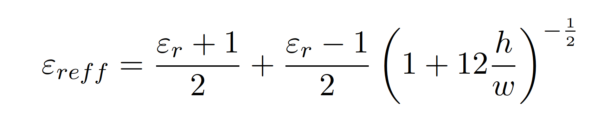
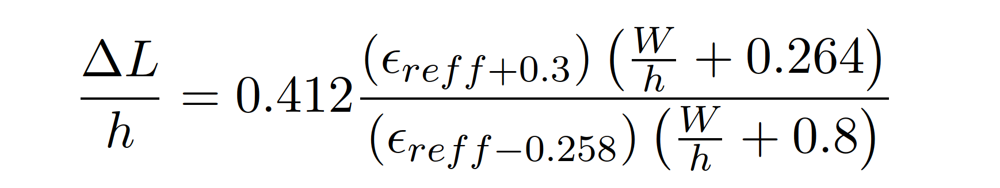
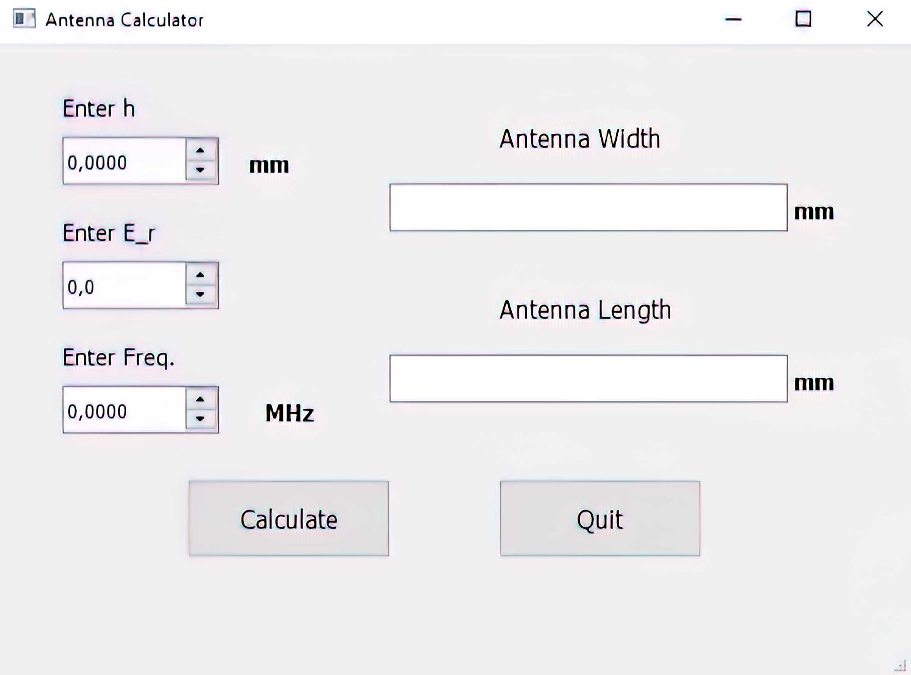

# Microstrip_An_Calculator

<!-- ABOUT THE PROJECT -->

<h2 align="center">About The Project</h2>

Using 'Microstrip Antenna Calculator', you can determine the length and 
width in millimeters of a rectangular microstrip antenna.

The formulas used are given below:
---

---

---

---

---

---

## Getting Started

The main.exe file, where is created under the app folder, can be run after the double click on its in the windows machine.

## License

Distributed under the MIT License. See `LICENSE` for more information.

## Contact

Hasan YİĞİT - [@ygthasan](https://www.linkedin.com/in/ygthasan/) - yigithasan22@gmail.com

